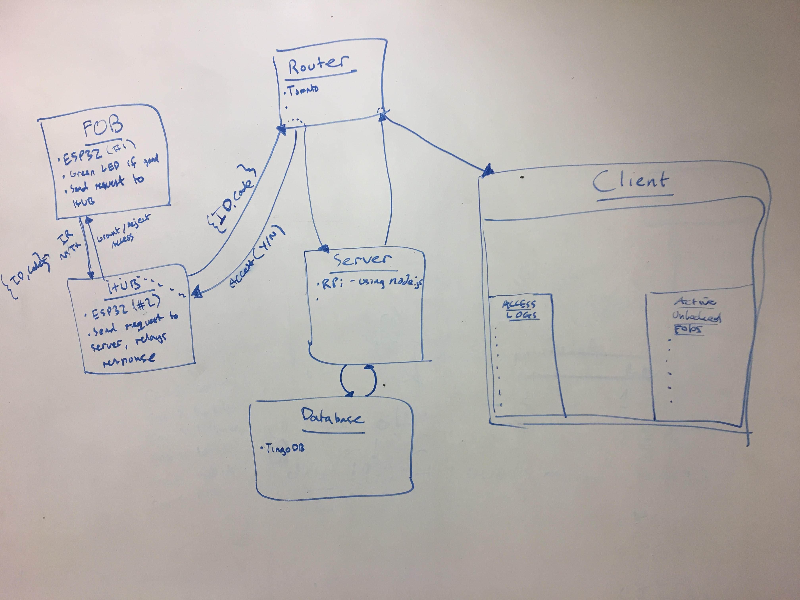
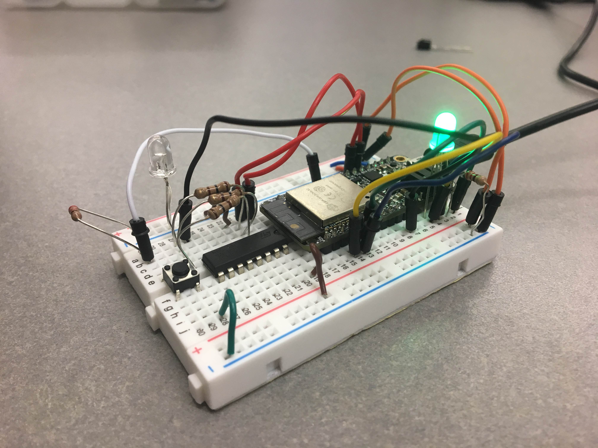
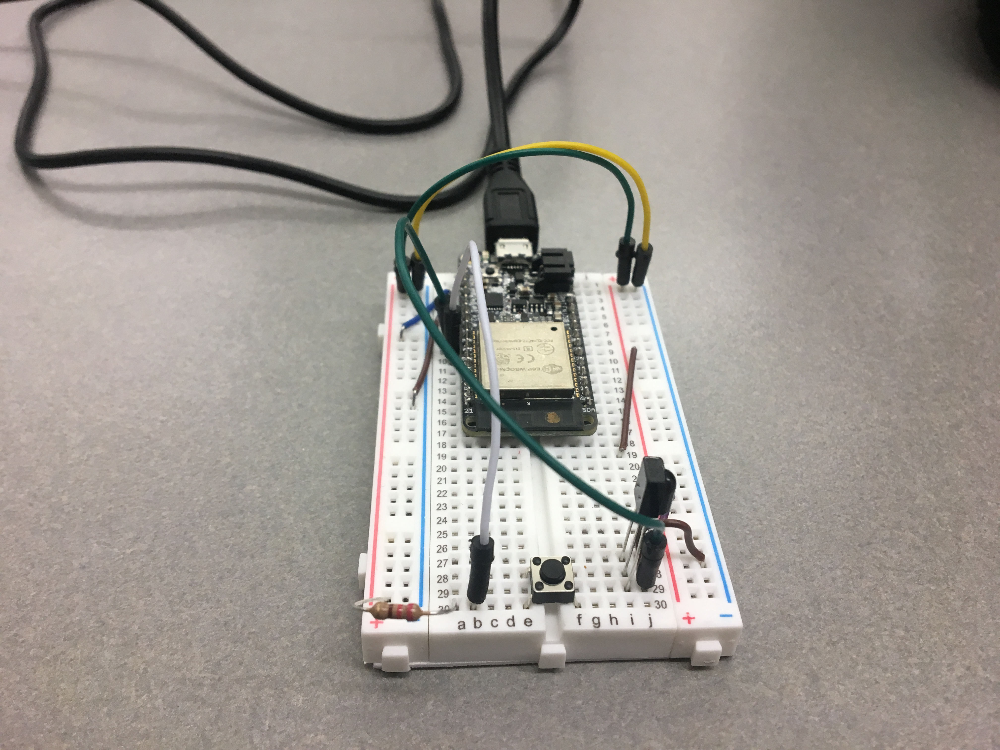
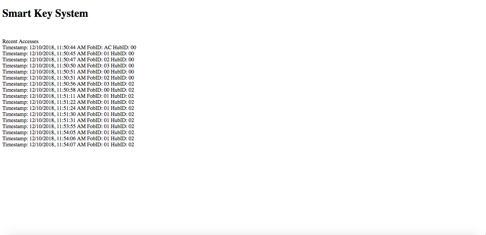

Author: Brian Xu
2018-12-6

## Summary
 In this quest, I was tasked with implementing a smart key, sercurity hub, and TingoDB database system. This system works in a way such that when the fob is put into the proximity of the security hub, the key sends an IR signal containing the fob's unique ID and password.
 This information is then compared to the correct values stored and pre-determined on the hub. From there, the hub will send the information to a Raspberry Pi, which is hosting our database of login history, as well as send an access or rejection signal back to the fob using HTTP requests. Then, an LED on the fob will be green or red, signalling successful login or rejection.

 Concurrently, the information sent to the database is also sent to a remote client displaying the log history of the security hub. This includes the fob ID, timestamp, password, etc.

## Evaluation Criteria

It was decided on the following specifications for a successful solution to this quest:

 - Fob can send IR signal to Hub
 - Fob can receive access/rejection through network
 
 - Hub can send log information to RPi database
 - Hub can differentiate incorrect vs. correct password
 - Hub can send HTTP request back to the Fob via network
 
 - RPi can host the client
 - RPi can host database and log values correctly
 
 - Client can display log history
 
 
## Solution Design
I used Huzzah32 boards (based on the the ESP32 board) and an RPi as the main processors in this quest. The ESP32 is interfaced to send and receive IR signals as well as host servers in our local area network. In this project, the ESP32 is used as the Fob and Hub while the RPi is used to host the database and client.

Fob Build Details: 
- IR Transmitter : GPIO Pins A0 and A1. Transmits code and ID information through IR.
- Access LED : GPIO Pins 33, 15, and 32. Used to signify access denied or granted.
- Button : GPIO Pin A5. Used to start the sending of the IR signal as well as increment the FOB ID.

Hub Build Details:
- IR Receiver : GPIO Pin A2. Used to receive code and ID information.
- Button : GPIO Pin A5. Used to change HUB ID.

## Security Concerns and Solutions

Issue #1 : Anyone with an IR receiver AND exposure of the fobs could steal the password and ID of the fob, assuming they know the start bit of our transmission.
The IR transmitters are beacons and will transmit their code and ID indiscriminantly.

Solution : The hub could also require an IP address as well as the password and ID. This means that even if you had the password and ID of a certain fob, you would not be able to access the hub unless you also had the unique fob with its unique IP adress.

Issue #2 : There is no limit to the amount of login attempts, meaning our security hub could technically be brute forced quite easily considering ID is only two digits and password is only one digit.

Solution : I could increase the digit length of both ID and passowrd as well as introduce a sanity check that locks a certain ID from logging in after a certain amount of incorrect attempts.

Issue #3 : There is a lack of encryption on our database. This means if you are in our local area network, you could request the information on the database which includes all the passwords and IDs for our fobs and hubs

Solution : Encrypt our database!!!!

## Sketches and Photos

 State Diagram :

 Key Fob :

 Security Hub (Overhead) :

 Client Output :

## Modules, Tools, Source Used in Solution

- TingoDB Reference [http://www.tingodb.com/]
- MongoDB+RPi Setup [http://raspberrypituts.com/nodejs-mongodb-web-server-raspberry-pi-tutorial/]
- Socket.io Reference [https://github.com/socketio/socket.io/tree/master/examples]
- Wiring template [http://whizzer.bu.edu/images/ir-beacon.jpg]
- Database Design Pattern [http://whizzer.bu.edu/guides/design-patterns/dp-db]
- Node.js [https://nodejs.org/en/]

## Supporting Artifacts

- [Github repo for our solution](https://github.com/BU-EC444/Quest5-Team15-Xu-Devlin-Malikayil/tree/master/code)
- [Youtube video demo](https://youtu.be/OjxI0EvOR90)
